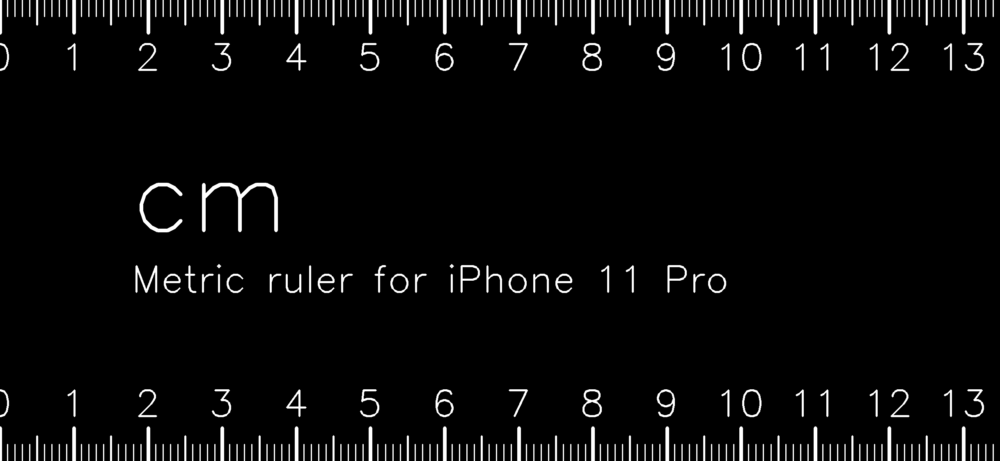

<div style="text-align: center;">

# Phone Ruler Image Generator

This project generates ruler images for various phone models, allowing you to use your phone as a quick and convenient ruler without the need for a separate app.


</div>

## Description

The Phone Ruler Image Generator is a Python script that creates precise ruler images tailored to specific phone models. It generates both metric (centimeters) and imperial (inches) rulers, taking into account the exact dimensions of each phone model.

The main idea is to provide a simple, app-free solution for using your phone as a measuring tool. By generating an image that matches your phone's screen dimensions, you can simply save the image and use it as a wallpaper or open it when needed to make quick measurements.

## Features

- Generates ruler images for various phone models
- Supports both metric (cm) and imperial (inch) measurements
- Takes into account the exact dimensions of each phone model for accuracy
- Easy to use command-line interface
- Expandable: new phone models can be easily added to the CSV file
- Pre-generated images for all supported phone models

## Requirements

- Python 3.6+
- OpenCV
- NumPy

You can install the required packages using the provided `requirements.txt` file:

```
pip install -r requirements.txt
```

## Usage

0. Run the script with your phone model as an argument:
   ```
   python generate_ruler_images.py iphone16pro
   ```

   Replace `iphone16pro` with your specific phone model.

1. The script will generate two images in the `generated_images` directory:
   - `Ruler_<model>_metric.png`: Ruler with centimeter markings
   - `Ruler_<model>_imperial.png`: Ruler with inch markings
   
   Use them :)

## Pre-generated Images Gallery

We've pre-generated ruler images for all supported phone models. You can download these images directly without running the script. To use an image:

1. Find your phone model in the table below (scroll right to see more models).
2. Click on the image in the "Metric (cm)" or "Imperial (inches)" row to view it in full size.
3. Right-click (or long-press on mobile) on the full-size image and select "Save image as" or "Download image".

Scroll right to see more models →

| Measurement System | iPhone 16 Pro Max | iPhone 16 Pro | iPhone 16 Plus | iPhone 16 | iPhone 15 Pro Max | iPhone 15 Pro | iPhone 15 Plus | iPhone 15 | iPhone 14 Pro Max | iPhone 14 Pro | iPhone 14 Plus | iPhone 14 | iPhone 13 Pro Max | iPhone 13 Pro | iPhone 13 | iPhone 13 mini | iPhone 12 Pro Max | iPhone 12 Pro | iPhone 12 | iPhone 12 mini | iPhone 11 Pro Max | iPhone 11 Pro | iPhone 11 | iPhone XS Max | iPhone XS | iPhone X | iPhone XR |
|--------------------|-------------------|----------------|-----------------|-----------|-------------------|----------------|-----------------|-----------|-------------------|----------------|----------------|-----------|-------------------|----------------|------------|-----------------|-------------------|----------------|------------|-----------------|-------------------|----------------|------------|----------------|------------|-----------|-----------|
| Metric (cm) |  |  |  |  |  |  |  |  |  |  |  |  |  |  |  |  |  |  |  |  |  |  |  |  |  |  |  |
| Imperial (inches) |  |  |  |  |  |  |  |  |  |  |  |  |  |  |  |  |  |  |  |  |  |  |  |  |  |  |  |

## Adding New Phone Models

To add a new phone model:

1. Open the `phone_models.csv` file.
2. Add a new row with the following information:
   - `model`: A unique identifier for the phone model (e.g., `iphone16pro`)
   - `name`: The display name of the phone model (e.g., `iPhone 16 Pro`)
   - `h_px`: The height of the screen in pixels
   - `w_px`: The width of the screen in pixels
   - `d_in`: The diagonal screen size in inches

You can either add the model for yourself or open a pull request to contribute it to the project.

## License

This project is free and open source. It carries no license, which means it is in the public domain. You are free to use, modify, and distribute it as you see fit. However, please note that this comes with no warranties or guarantees of any kind.

## Contributing

Contributions are welcome! If you'd like to add support for new phone models, improve the code, or enhance the documentation, please feel free to open a pull request.

## Disclaimer

While we strive for accuracy, the generated rulers should not be used for precise measurements where accuracy is critical. The accuracy of the ruler images depends on the correctness of the phone specifications provided and the accuracy of your phone's display calibration.

